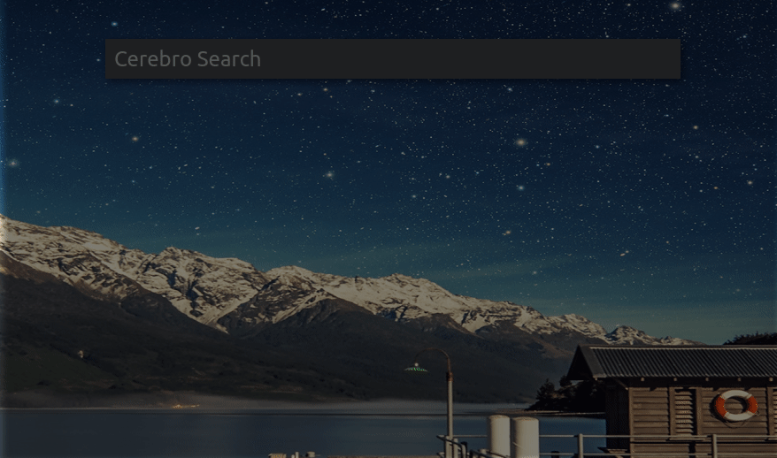

# AWS Console - Cerebro Plugin

> [Cerebro](http://www.cerebroapp.com) Simple Cerebro plugin to open AWS Console services in your default browser.

> Note: it works only with Cerebro version >= 0.3.0

## Usage

In Cerebro, type `aws ` + your text. 
Once selected it will open the link of the AWS Console service.

## Related

- [Cerebro](http://github.com/KELiON/cerebro) – main repo for Cerebro app;

## License

MIT © [Alejandro Scandroli]
